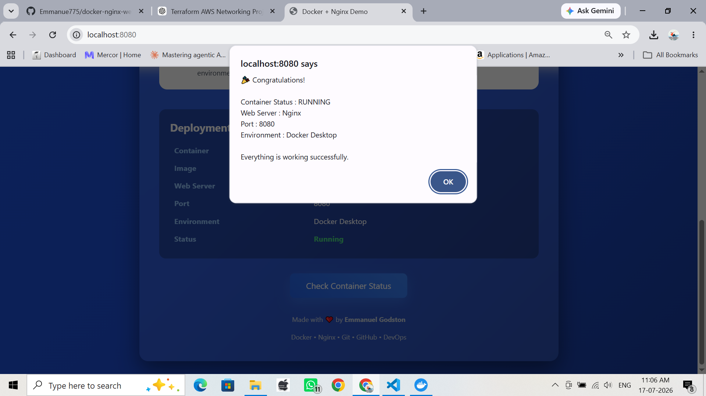
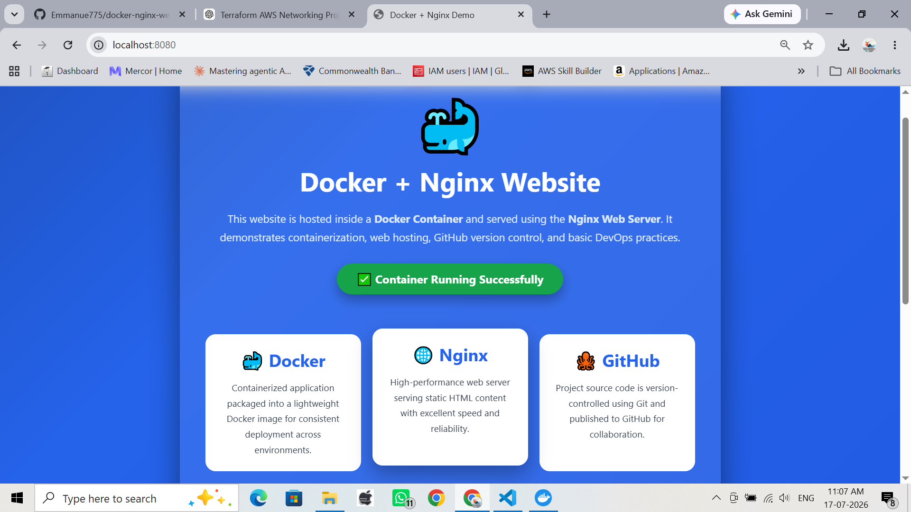

# Docker Nginx Website

A simple static website hosted using Nginx inside a Docker container.

## Features

- Dockerized Nginx server
- Static HTML website
- Docker Compose support
- Custom Nginx configuration

## Project Structure

docker-nginx-website/
├── html/
│   └── index.html
├── Dockerfile
├── docker-compose.yml
├── nginx.conf
└── README.md

## Technologies

- Docker
- Docker Compose
- Nginx
- HTML

## Run

### Build

docker build -t nginx-demo .

### Run

docker run -d --name nginx-demo-container -p 8080:80 nginx-demo

Or

docker compose up --build

Visit:

http://localhost:8080

## Preview

